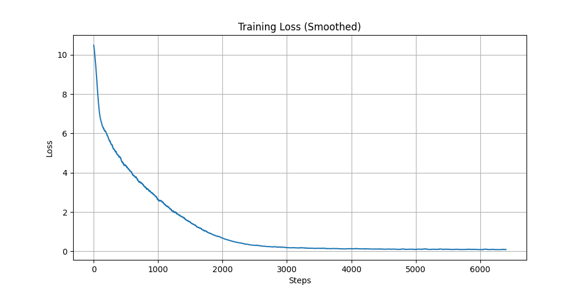

[](https://github.com/mohd-faizy)


*A minimal PyTorch implementation of GPT-1 for educational purposes, optimized for Google Colab and CPU training*

---

## 🛠️ Installation

### For VS Code/Local Setup

```bash
# Clone repository
git clone https://github.com/mohd-faizy/gpt1-from-scratch.git
cd gpt1-from-scratch

# Create and activate virtual environment (recommended)
python -m venv gpt-env
source gpt-env/bin/activate  # Linux/Mac
.\gpt-env\Scripts\activate   # Windows

# Install core dependencies
pip install -r requirements.txt

# Train the model 
!python train.py 

# Model inference
!python inference.py
```


## 🚀 Quick Start

### Google Colab Workflow

```python
# 1. Clone the repository
!git clone https://github.com/mohd-faizy/gpt1-from-scratch.git

# 2. Change to the project directory
import os
os.chdir('/content/gpt1-from-scratch')

# 3. Install required libraries
!pip install datasets transformers accelerate matplotlib -q
%matplotlib inline

# 4. Train the model with 3 epochs
!python train.py --epochs 3 --batch_size 32

# 5. Train with default settings
!python train.py

# 6. Generate text with default settings
!python inference.py

# 7. Generate text using the trained model
!python inference.py --prompt "what is AI?" --temperature 0.7
```

### Local/VS Code Workflow


```bash
# Train the model with custom parameters
python train.py \
    --batch_size 16 \          # Number of samples per batch
    --max_seq_len 128 \        # Maximum sequence length
    --epochs 10                # Number of training epochs
```

```bash
# Generate text with custom settings
python inference.py \
    --prompt "The future of AI" \  # Starting text for generation
    --temperature 0.8 \            # Controls randomness (0.8 = more creative)
    --top_k 100 \                  # Limits to top 100 likely tokens
    --max_length 200               # Maximum tokens to generate
```

## 📂 Repository Structure

```
.
├── 📄 config.py          # Model configuration ⚙️
├── 📄 dataset.py         # Data pipeline 🗂️
├── 📄 inference.py       # Text generation 💬
├── 📄 model.py           # GPT architecture 🧩
├── 📄 requirements.txt   # Dependencies 📦
├── 📄 train.py           # Training script 🏋️
├── 📄 utils.py           # Visualization 📊
├── 📁 tokenizer/         # Saved tokenizer
├── 📄 gpt_model.pth      # Trained weights
└── 📄 README.md          # Documentation
```

## 🖥️ Execution Guide

### Google Colab Specifics

1. Start a new notebook: `File > New notebook`
2. Run all Colab commands in sequence
3. Monitor training:
   - Progress bars update every 10 epochs
   - Loss plot auto-saves as `training_loss.png`
4. Find outputs:
   - Model weights: `gpt_model.pth`
   - Training log: `training.log`

### VS Code Tips

1. Recommended extensions:
   - Python (Microsoft)
   - Pylance
   - Jupyter (for notebook support)
2. Debugging:
   - Set breakpoints in `train.py`
   - Use `Debug > Start Debugging`
3. Monitoring:
   - Check `training.log` for detailed metrics
   - Run `python -c "from utils import plot_loss; plot_loss()"` to view loss

---

## 📊 Monitoring Training

```bash
# Plot training loss (works in both environments)
python -c "from utils import plot_loss; plot_loss()"
```

<!--  -->

---

## 🚨 Troubleshooting

| Issue                        | Solution                          |
|------------------------------|-----------------------------------|
| `CUDA out of memory`         | Reduce batch size (8 or 16)       |
| `Tokenizer not found`        | Run training before inference     |
| `Matplotlib not displaying`  | Add `%matplotlib inline` in Colab |
| `NaN loss values`            | Lower learning rate (try 1e-4)    |
| `Slow training`              | Use Colab GPU runtime             |

---

## 🔧 Customization Guide

Edit `config.py` for model adjustments:

```python
CONFIG = SimpleNamespace(
    n_layer=4,              # Reduce to 2 for faster training
    d_model=256,            # Embedding dimension
    lr=2e-4,                # Learning rate
    warmup_steps=100,       # Learning rate warmup
    subset_size=500,        # Dataset sample size
)
```

---

## 📚 Resources & Citations

- [Attention Is All You Need (2017)](https://arxiv.org/abs/1706.03762)
- [HuggingFace Transformers](https://github.com/huggingface/transformers)
- [PyTorch Tutorials](https://pytorch.org/tutorials/)


## ⚖ ➤ License

This project is licensed under the MIT License. See [LICENSE](LICENSE) for details.

## ❤️ Support

If you find this repository helpful, show your support by starring it! For questions or feedback, reach out on [Twitter(`X`)](https://twitter.com/F4izy).

## 🔗Connect with me

➤ If you have questions or feedback, feel free to reach out!!!

[][twitter]
[][linkedin]
[][Portfolio]

[twitter]: https://twitter.com/F4izy
[linkedin]: https://www.linkedin.com/in/mohd-faizy/
[Portfolio]: https://ai.stackexchange.com/users/36737/faizy?tab=profile

---


